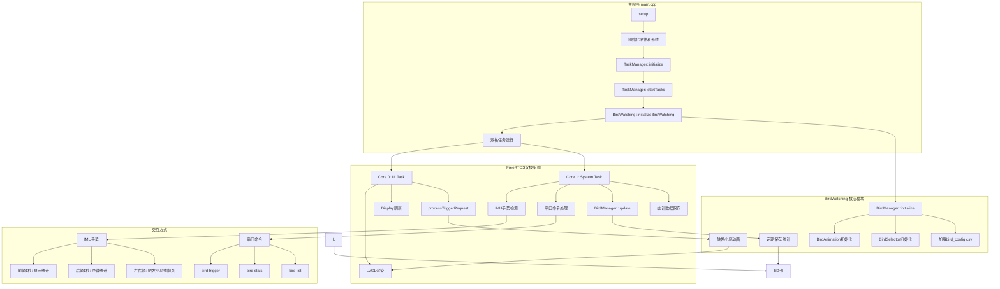
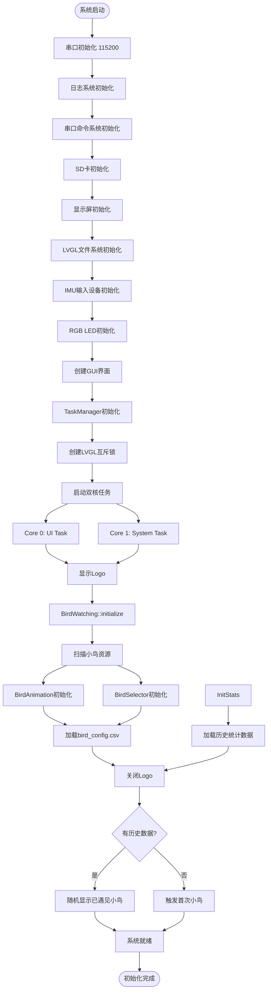
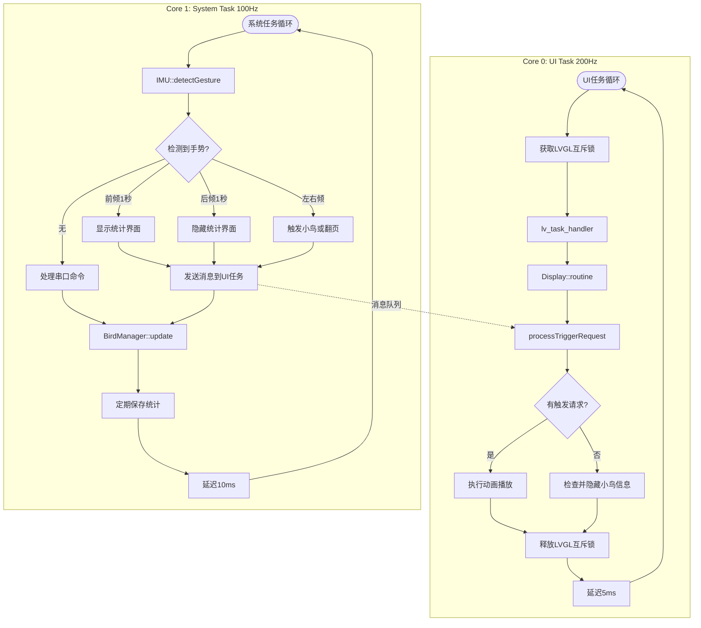
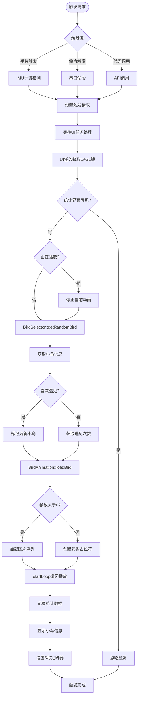
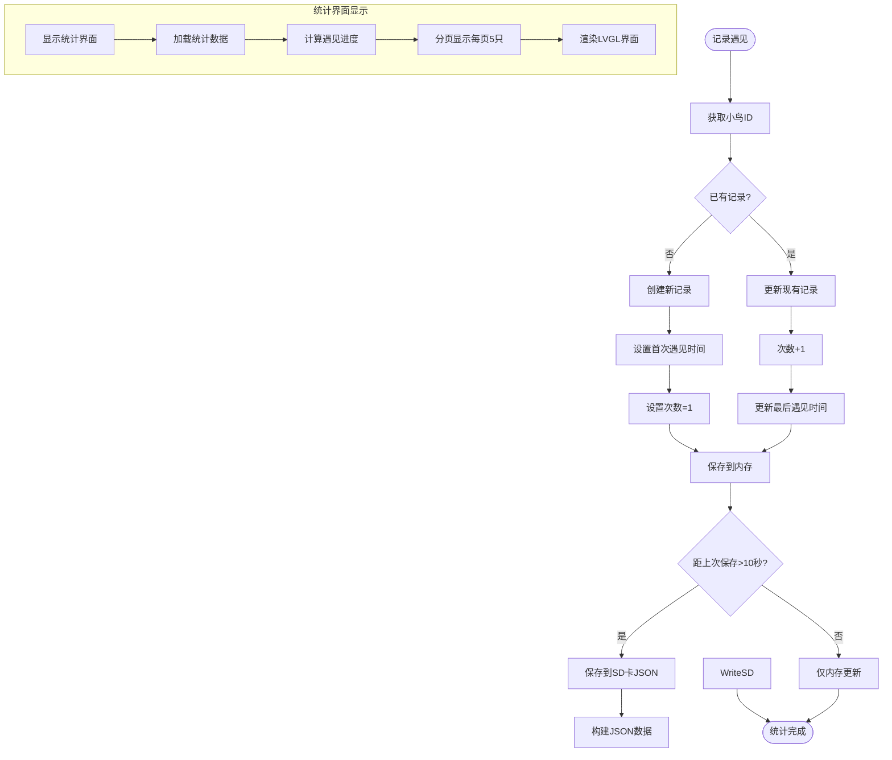
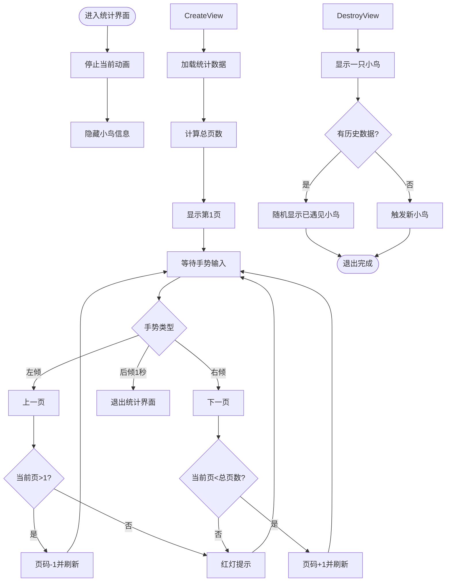
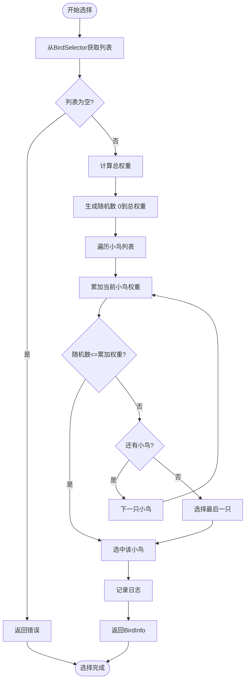
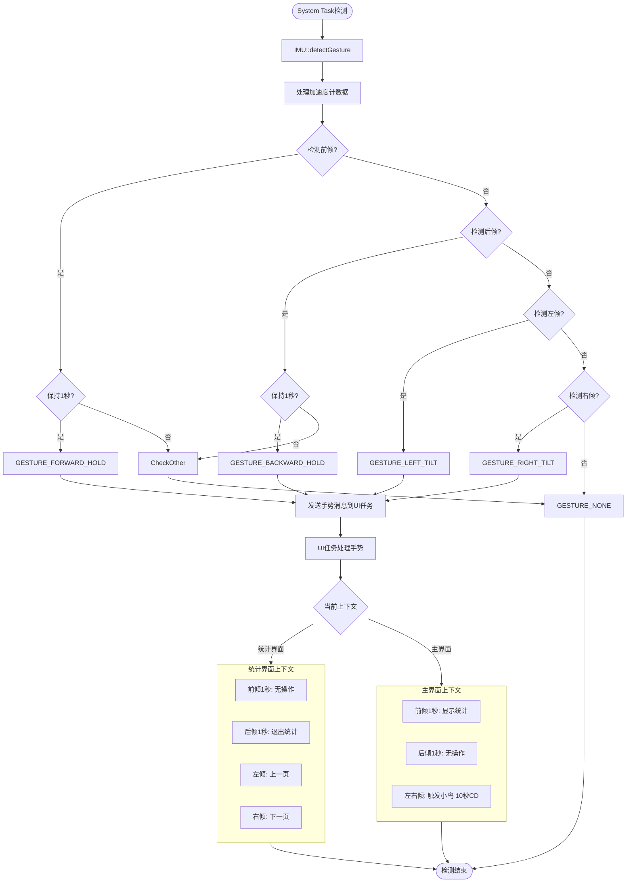
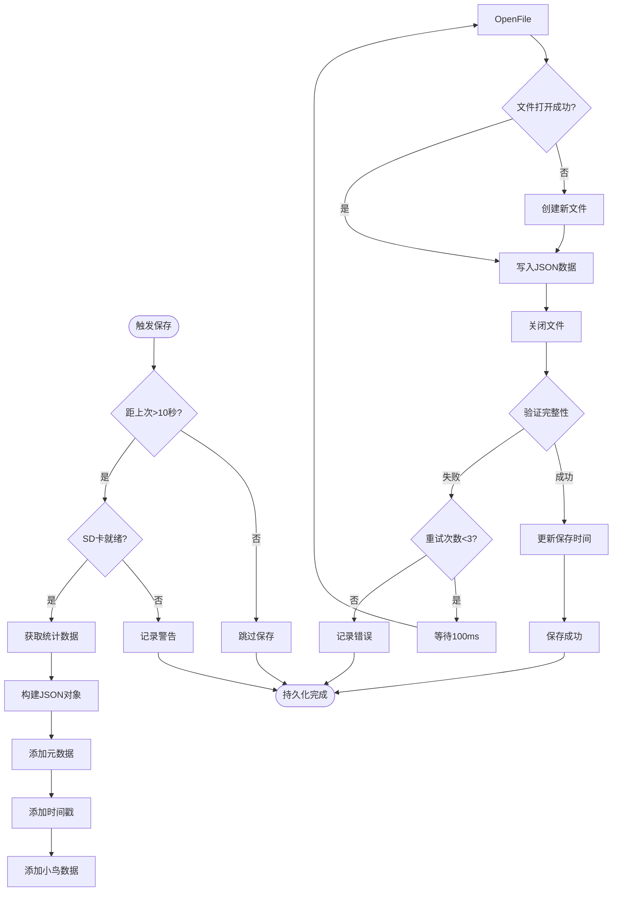
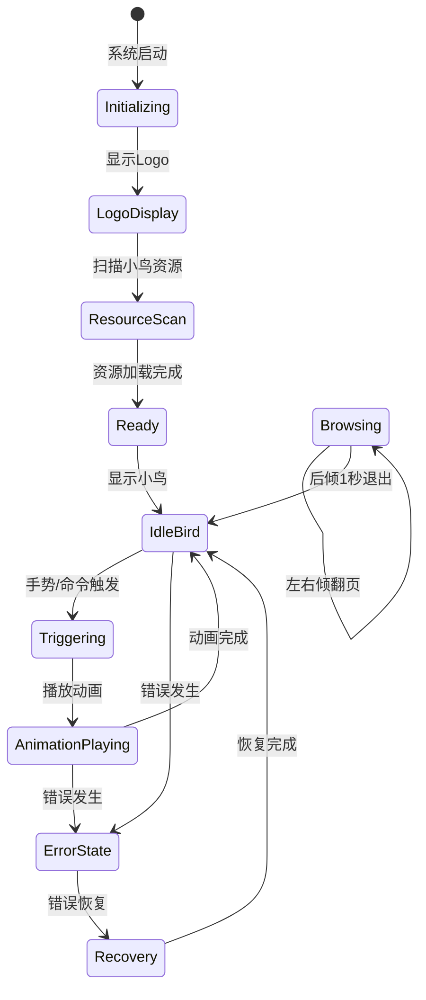

# BirdWatching模块完整运行流程示意图

## 系统架构概览



## 初始化流程



## 双核任务运行流程



## 小鸟触发流程



## 统计系统流程



## 统计界面交互流程



## 小鸟选择算法流程



## 手势检测处理流程



## 数据持久化流程



## 系统状态图



## 总结

BirdWatching模块是一个完整的嵌入式观鸟应用系统，基于ESP32双核架构开发，具有以下特点：

### 核心架构
- **双核FreeRTOS架构**: Core 0处理UI渲染，Core 1处理系统逻辑和传感器
- **任务间通信**: 通过消息队列和互斥锁实现线程安全的跨核通信
- **LVGL集成**: 使用互斥锁保护所有LVGL对象访问
- **模块化设计**: BirdManager、BirdAnimation、BirdSelector独立模块

### 交互方式
- **IMU手势控制**:
  - 前倾保持1秒: 显示统计界面
  - 后倾保持1秒: 退出统计界面
  - 左右倾: 主界面触发小鸟(10秒CD) / 统计界面翻页
- **串口命令**: 
  - `bird trigger`: 触发小鸟
  - `bird stats`: 显示统计
  - `bird list`: 列出所有小鸟
  - `bird reset`: 重置统计数据

### 数据管理
- **统计追踪**: 遇见次数、首次/最后遇见时间、进度计算
- **持久化存储**: SD卡JSON格式，每10秒自动保存
- **配置文件**: bird_config.csv定义小鸟列表和权重
- **分页显示**: 统计界面每页显示5只小鸟

### 视觉反馈
- **小鸟信息显示**: 右下角显示小鸟名称和遇见次数，5秒后自动隐藏
- **新小鸟提示**: 首次遇见时特殊显示"加新{小鸟名字}！"
- **RGB LED提示**: 手势操作时LED闪烁反馈（绿色/蓝色/红色）
- **Logo过渡**: 启动时显示Logo，资源扫描完成后自动切换

### 技术特性
- **加权随机选择**: 基于权重的小鸟选择算法
- **资源管理**: 支持图片帧序列和彩色占位符
- **错误处理**: 完善的异常处理和日志记录
- **性能优化**: 看门狗配置、防抖处理、定时器管理
- **线程安全**: 跨核访问LVGL使用互斥锁保护

### 文件结构
```
src/applications/modules/bird_watching/
├── core/
│   ├── bird_watching.h/cpp      # 主接口
│   ├── bird_manager.h/cpp       # 核心管理器
│   ├── bird_animation.h/cpp     # 动画播放
│   ├── bird_selector.h/cpp      # 选择算法
│   ├── bird_types.h             # 类型定义
│   └── bird_utils.h/cpp         # 工具函数
└── screens/
    └── bird_animation_bridge.h/cpp  # GUI桥接

SD卡文件:
├── /configs/bird_config.csv     # 小鸟配置
├── /birds/{id}/                 # 小鸟图片资源
```

该系统已完全集成到ESP32主项目中，作为独立的功能模块稳定运行，支持实时交互和数据持久化。