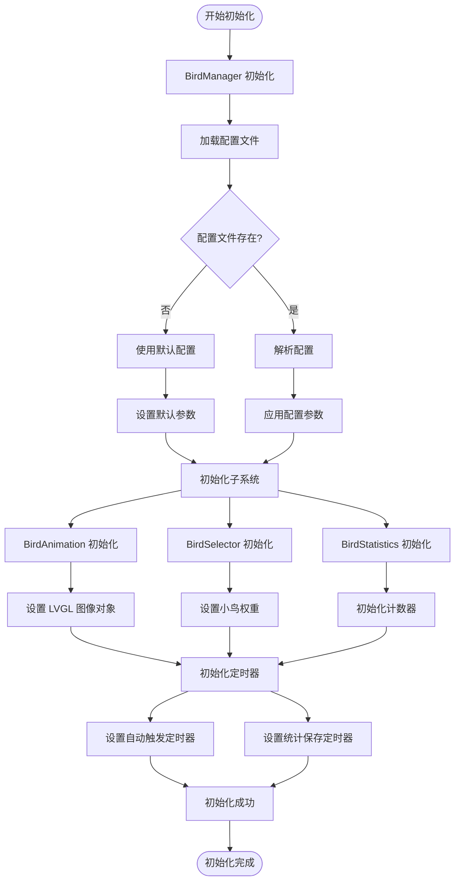
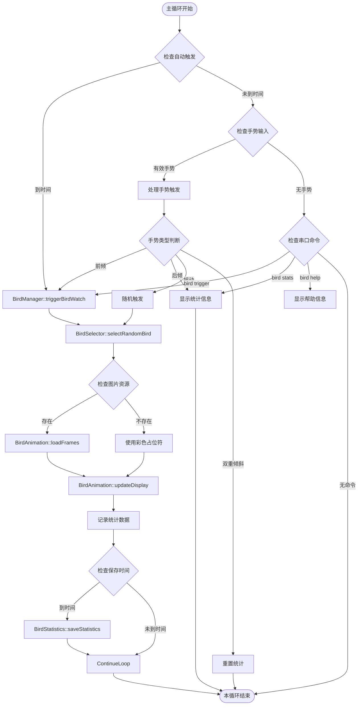
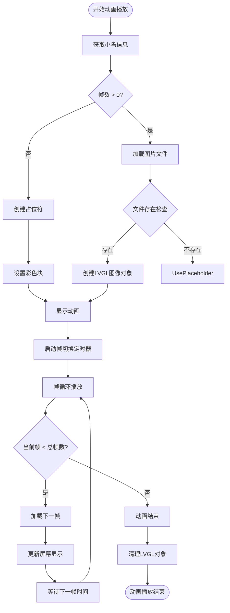
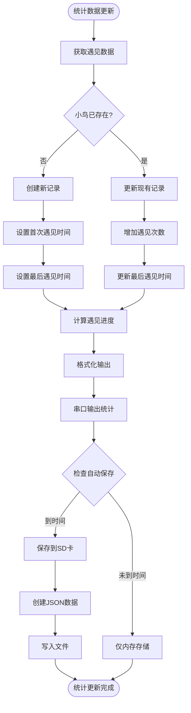
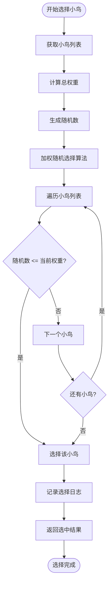
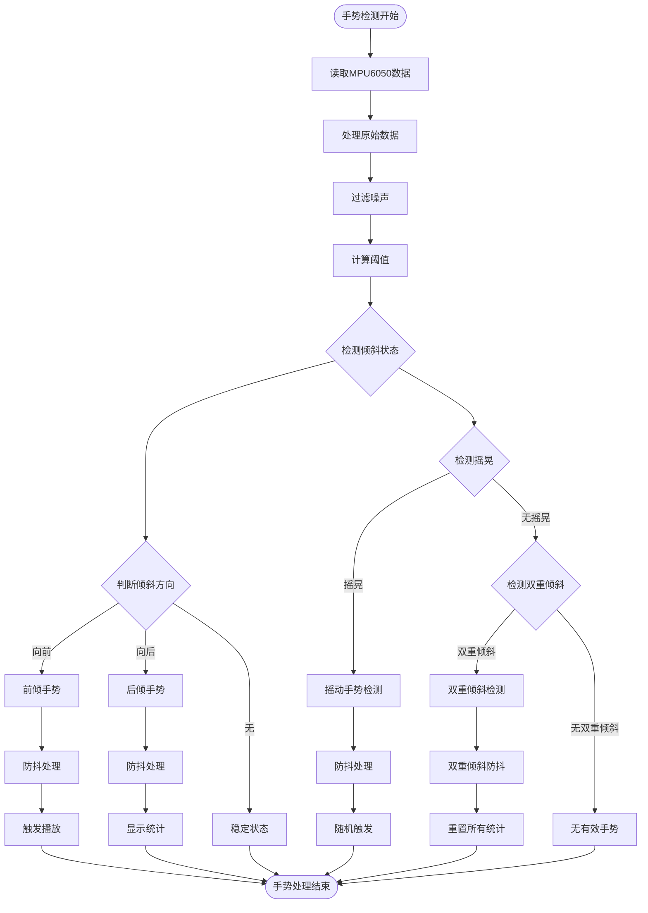
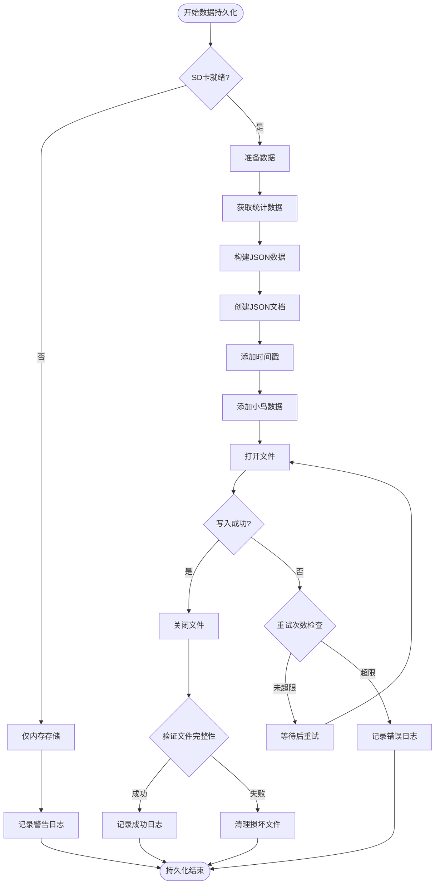
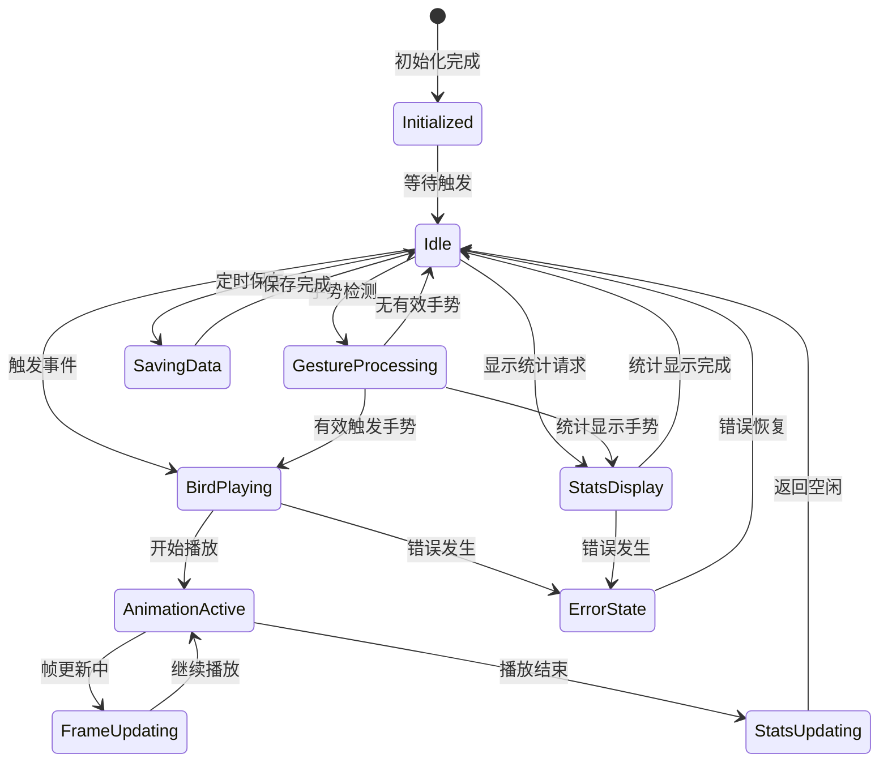

# BirdWatching模块完整运行流程示意图

## 系统架构概览

```mermaid
graph TB
    subgraph "主程序 (main.cpp)"
        A[setup()] --> B[BirdWatching::initializeBirdWatching()]
        C[loop()] --> D[BirdWatching::updateBirdWatching()]
    end

    subgraph "BirdWatching 核心模块"
        B --> E[BirdManager::initialize]
        D --> F[BirdManager::update]

        E --> G[BirdAnimation]
        E --> H[BirdSelector]
        E --> I[BirdStatistics]
        E --> J[配置加载]

        F --> G
        F --> H
        F --> I
    end

    subgraph "外部系统交互"
        K[串口命令系统] --> L["bird trigger", "bird stats"]
        M[MPU6050传感器] --> N[手势检测]
        O[定时器系统] --> P[自动触发]
        Q[SD卡存储] --> R[统计数据持久化]
        S[LVGL显示系统] --> T[动画播放界面]
    end

    L --> F
    N --> F
    P --> F
    I --> Q
    G --> S
```

## 初始化流程



## 主循环运行流程



## 动画播放子流程



## 统计系统子流程



## 小鸟选择算法流程



## 手势检测处理流程



## 数据持久化流程



## 系统状态图



## 总结

BirdWatching模块是一个完整的嵌入式观鸟应用系统，具有以下特点：

### 核心功能
- **智能触发机制**: 支持自动触发、手势触发、串口命令触发
- **丰富的小鸟选择**: 基于权重的随机选择算法
- **流畅的动画播放**: LVGL集成的帧序列播放系统
- **完整的统计追踪**: 遇见次数、时间、进度等数据分析
- **可靠的数据持久化**: SD卡存储与JSON格式

### 技术特性
- **模块化设计**: 职责分离，易于维护和扩展
- **资源管理**: 智能的占位符机制和内存管理
- **错误处理**: 完善的异常处理和恢复机制
- **性能优化**: 定时器管理、防抖处理、批量操作

该系统已完全集成到ESP32主项目中，可以作为独立的观鸟功能模块稳定运行。